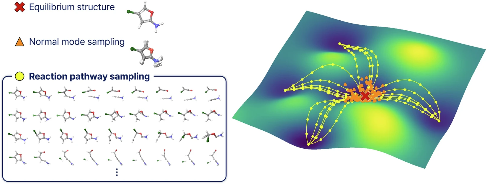
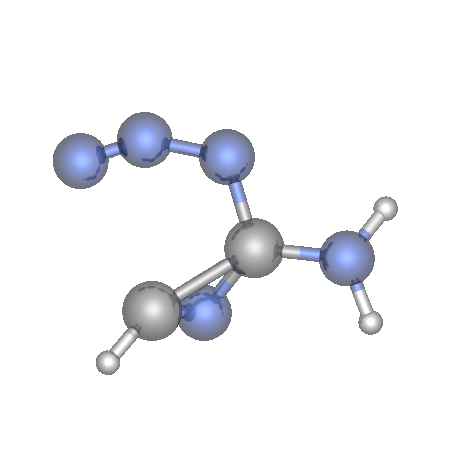

  ## Generative Chem Reaction Structures Hackathon

This project is the working repository for the AI Schmidt Hackathon 2026 challenge on generating 3D transition-
state (TS) structures for chemical reactions. Participants are given reaction data containing reactant
structures, product structures, and reference transition-state geometries, and the goal is to build models that
can predict the TS geometry as accurately as possible from the available inputs.

In practical terms, the hackathon sits at the intersection of machine learning, molecular structure prediction,
and reaction modeling. The repository includes baseline code, example notebooks, and datasets derived from
resources such as transition1x and Halo8. These materials are intended to help participants understand the data
format, run a reference model, and develop improved methods for TS structure generation and evaluation.

  ## Participant Objectives

Participants in the hackathon are expected to:

- Understand the reaction-structure data provided in this repository.
- Use reactant and product geometries (transition1x dataset) to predict the corresponding transition-state structure.
- Can start from the provided baselines and modify, replace, or extend them with their own approach.
- Evaluate performance against shared metrics such as RMSD and comparison to midpoint-based baselines. Bonus for teams that achieve an RMSD score of lower than 0.01!
- Clearly document any additional assumptions, features, or external information used in their method.

## Clone and Initial Setup

Clone the repository first:

```bash
git clone https://github.com/siddarthachar/generative_chem_reactive_structures.git
cd generative_chem_reactive_structures
```

## Environment Setup

- This repo uses a small Python stack: `numpy`, `torch`, `ipykernel`
- Additional libraries for visualization: `ase`, `py3dmol`
- To run notebooks: `jupyterlab`

### Midway3 (RCC Cluster) — Recommended for Hackathon

The hackathon base environment is pre-installed on Midway3 at `/project/ai4s-hackathon/ai-sci-hackathon-2026/hackathon-base`. Rather than duplicating the full environment, you'll create a lightweight personal virtual environment that builds on top of it.

> Please do not run any computationally heavy processing on the login node (this is the node you land on when ssh'ing to the cluster). It is okay to set up your environment on the login node but please consider using an interative job or a batch script for any other work. See the ["README on RCC"](rcc.submit/README.md).

#### One-Time Shell Configuration

The very first time you log in, you need to initialize conda for your shell. You only need to do this once:

```bash
module load python/miniforge-25.3.0
conda init
source ~/.bashrc
```

#### Setting Up Your Personal Environment

Run these commands once after the shell configuration above to create a virtual environment (`venv`) from the base `conda` environment:

```bash
# 1. Load conda
module load python/miniforge-25.3.0

# 2. Activate the shared hackathon conda environment
conda activate /project/ai4s-hackathon/ai-sci-hackathon-2026/hackathon-base

# 3. Create your personal virtual environment in your home directory
python -m venv --system-site-packages ~/my-hack-venv

# 4. Activate your personal environment
source ~/my-hack-venv/bin/activate
```

#### Every Subsequent Session

Run these commands to load and activate your virtual environment that references the base `conda` environment:

```bash
module load python/miniforge-25.3.0
conda activate /project/ai4s-hackathon/ai-sci-hackathon-2026/hackathon-base
source ~/my-hack-venv/bin/activate
```

#### Installing Additional Packages

Make sure your personal venv is active first, then:

```bash
pip install <package-name>
```

This installs only into your personal environment — the shared base is not affected. To see only the packages you've added (vs. what's inherited from the base):

```bash
pip list --local
```

#### Troubleshooting

If you run into a package conflict or something breaks, you can delete and recreate your personal `venv` without touching the shared environment:

```bash
rm -rf ~/my-hack-venv
module load python/miniforge-25.3.0
conda activate /project/ai4s-hackathon/ai-sci-hackathon-2026/hackathon-base
python -m venv --system-site-packages ~/my-hack-venv
source ~/my-hack-venv/bin/activate
```

---

> If you plan to make developments locally on your PC, then here are some tips to set up either `uv` or `conda` environments. It may be more convenient for some to make changes locally and perform model training/test on the cluster (RCC). Please refer to [`local_dev/README.md`](local_dev/README.md) on help with setting it up locally.

## Quick Start: Example Runs

### Example A: Train and evaluate the EGNN baseline script

This script uses equivarient graph neural networks (EGNN) for molecular representation and conditional flow matching for prediction. Details are explained later in the doc. Participants can use this script as a base structure and implement their own method. 

```bash
python Code/Examples/train_and_eval_egnn.py \
  --pkl Data/transition1x/train.pkl \
  --atom-count 10 \
  --epochs 3 \
  --train-samples 200 \
  --eval-samples 100 \
  --out-dir outputs_xyz
```

What this does:
- Loads the dataset from `Data/transition1x/train.pkl`
- Filters to fixed atom count (default 10) **NOTE: final implementation must be generalized to any atom count - not fixed**
- Trains a small EGNN baseline
- Reports RMSD (and optional energy MAE)
- Writes predicted TS structures as `.xyz` files into `outputs_xyz/`

### Example B: Run notebook baselines

You can go through some example jupyter notebooks. There are many ways to run these notebooks on RCC. Refer to "4. Launch a jupyter session on RCC" in [`rcc.submit/README.md`](rcc.submit/README.md#4-launch-a-jupyter-session-on-rcc) for help with setting up a jupyter notebook on RCC. There are other ways to run notebooks on RCC, including remote VSCode and OnDemand. Please contact your mentors if you are having trouble with setting up notebooks.

Refer to `Notebooks/example_baseline.ipynb` for a working example.

Other notebook examples:
- `Notebooks/example_baseline_reactOT.ipynb`
- `Notebooks/example_halo8_reactOT_rmsd.ipynb`
<!--
If needed, install notebook library:

```bash
uv sync --extra jupyter
``` -->

### Dataset Summary

This project dataset is organized around reaction triples:
- reactant structure (`reactant`)
- product structure (`product`)
- transition-state (TS) reference (`transition_state`)

Current local files include:
- `Data/transition1x/` contains `train.pkl`, `val.pkl`, `test.pkl`
- Entries include TS guess structures generated from prior quantum mechanics (QM)-based workflows (for example `ts_guess_*`-style fields).

What you find in each reaction entry (as used in notebooks/scripts):
- top-level keys: `reactant`, `product`, `transition_state`, `single_fragment`, `use_ind`, `ts_guess`, `ts_guess_sbv1`, `ts_guess_true`, `ts_guess_NEBCI-xtb`
- per-structure keys (inside `reactant`/`product`/`transition_state`): `positions`, `charges` (or `atomic_numbers`), `num_atoms`, `fragments`, `rxn`, and optional quantum properties (`wB97x_6-31G(d).energy`, forces, atomization energy)
- `positions` is the main supervised signal: an `N x 3` coordinate array for one structure


What this means for modeling:
- input condition: reactant + product coordinates (and atom identities)
- prediction target: transition-state coordinates for the same atoms
- standard baseline initialization: midpoint `x0 = 0.5 * (xR + xP)`
- evaluation question: does the predicted TS geometry reduce RMSD vs the midpoint baseline?

**BONUS:** Teams can also make their implementation transferable to `Data/Halo8/` dataset. Note that the atom types in the Halo8 dataset may different slightly to the transition1x. 

Concrete examples from the notebooks:
- `Notebooks/example_baseline_reactOT.ipynb`:
  - shows keys like `dict_keys(['reactant', 'transition_state', 'product', ...])`
  - picks a fixed atom-count subset (example run: most common `N=10`): **NOTE: Your code needs to be generic (i.e. transferable across all atom counts)** 
  - reports sample RMSD comparison (example run): midpoint->TS `0.4242`, predicted->TS `0.2174`
- `Notebooks/example_halo8_reactOT_rmsd.ipynb`:
  - uses `Data/halo8_rpsb_like_all.pkl`
  - evaluates on held-out data with summary stats (mean/median/p90 and `% improved vs midpoint`)

Expected output from code (what "good output" looks like):
- training/eval logs from `Code/Examples/train_and_eval_egnn.py`:
  - epoch losses, then aggregate metrics such as:
  - `model RMSD: ...`
  - `midpoint RMSD: ...`
  - optional `energy MAE (mean baseline): ...`
- generated structures:
  - predicted TS files are written to `outputs_xyz/ts_00000.xyz`, `ts_00001.xyz`, ...
  - each file is a single XYZ frame with comment `pred_ts_i` (see `Code/Wrappers/xyz.py`)
  - sample files are included in `sample_outputs_xyz/`



Figure 4 from the Transition1x paper: (a) is an example reaction from reactant to product through the transition state.


Figure 1 from Halo8 paper: Reaction path sampling from single reactant to multiple products.


Source papers / dataset links (to be added):
- Transition1x: Paper: [https://doi.org/10.1038/s41597-022-01870-w] Dataset:[https://doi.org/10.6084/m9.figshare.19614657.v4]
- Halo8: Paper: [https://doi.org/10.1038/s41597-025-05944-3] Dataset: [https://doi.org/10.5281/zenodo.16737590.]

Fair-use / evaluation note:
- Using these "smarter" TS guesses (other than `x0 = 0.5 * (xR + xP)`) as training inputs or features is allowed only with a competition penalty.
- For fair model comparisons, report clearly whether your method uses any TS guess (`ts_guess-*` in `transition1x`) information beyond reactant/product inputs.


## Visualization

Use the notebook below to inspect generated `.xyz` structures interactively - as shown in `Notebooks/xyz_visualization.ipynb`

Notebook highlights (from `Notebooks/xyz_visualization.ipynb`):
- Discovers `.xyz` files (or lets you set a specific file path like `outputs_xyz/ts_00000.xyz`)
- Loads single-frame or multi-frame XYZ data with ASE
- Supports inline visualization with ASE (`viewer='x3d'`)
- Supports inline `py3Dmol` rendering (single frame and animation)
- Supports optional desktop viewer launch via `ase gui`

<!-- If needed, install visualization extras:

```bash
uv sync --extra visualize
``` -->

## Methods: Equivariant Graph Neural Network (EGNN)

EGNNs are a class of neural networks designed specifically for modeling 3D molecular structures while respecting fundamental physical symmetries. Unlike standard graph neural networks, EGNNs ensure that predictions remain consistent under transformations that shouldn't affect the underlying physics.

Why Equivariance Matters:
1. Physics does not depend on coordinate frame: The laws of physics are invariant to translations, rotations, and permutations of atoms. A molecule's properties should remain the same regardless of how we orient or label it in space.
2. The same molecule rotated should give the same prediction (up to rotation): If you rotate a molecule as input, the predicted properties (like transition-state coordinates) should transform accordingly, maintaining the relative geometry.
3. NNs that respect physical symmetries: EGNNs explicitly enforce equivariance to translations, rotations, and permutations of atoms. This leads to more robust, data-efficient models that generalize better to unseen orientations and atom orderings.

The examples have an implementation from scratch. You do not have to use those. There are pre-built packages for EGNN: [egnn-torch](https://github.com/lucidrains/egnn-pytorch). 

[EGNN paper](https://arxiv.org/pdf/2102.09844)

`Notebook/example_masking.ipynb` has a script that attempts to make the EGNN generalized for all atom count by using masking. 

**Note:** You are not limited to EGNNs. Please feel free to use other methods upon convenience. 

## Methods: Conditional Flow Matching example

There are several methods of predicting these transition-state (TS) structures. Some generative examples are diffusion models and conditional flow matching. Participants can also test non-generative methods to make predictions.

**NOTE: You are not limited to using generative models. Any regression method is allowed**

This repository uses conditional flow matching (CFM) to generate a TS geometry from reactant and product structures. Rather than predicting the TS in one step, the model learns a continuous update rule for coordinates over time.

Let `x_R`, `x_P`, and `x_TS` denote reactant, product, and transition-state coordinates. At time `t in [0,1]`, the model predicts a vector field

$$v_\theta(x_t, t \mid x_R, x_P)$$

and evolves the structure by

$$\frac{d x_t}{dt} = v_\theta(x_t, t \mid x_R, x_P)$$

For a simple baseline, the trajectory starts from the coordinate-wise midpoint

$$x_0 = \frac{x_R + x_P}{2}$$

During training, the model matches a linear path from `x_0` to the true TS:

$$x_t = (1 - t)x_0 + t x_{TS}, \qquad$$
$$u_t = x_{TS} - x_0$$

with loss

$$
\mathcal{L} =
\mathbb{E}_{t,x_t}
\| v_\theta(x_t, t \mid x_R, x_P) - u_t \|^2
$$

In short: reactant and product define the endpoints, the midpoint provides a simple initialization, and the learned flow refines that structure toward the TS.

**Note:** There are existing flow matching packages that one could use: [Meta flow matching](https://github.com/facebookresearch/flow_matching/tree/main)

### Example flow-matching output

The sample animation below uses a simple baseline initialization: the starting structure is the coordinate-wise mean of the reactant and product states. From that baseline, flow matching evolves the geometry toward the transition state (TS).



The sample `.xyz` outputs used for inspection live in `sample_outputs_xyz/`.


## Evaluation (How your model is scored)

- **Metric:** RMSD between predicted TS and ground-truth TS
- **Baseline:** midpoint initialization

`x_mid = 0.5 * (x_R + x_P)`

- **What matters:** improvement over baseline

`Δ = RMSD(midpoint, TS) − RMSD(model, TS)`

- **We report:**
  - Mean RMSD (lower is better)
  - % of reactions improved vs midpoint

**Note:** It could be useful to check if your molecules are aligned correctly before computing your RMSD. The RMSD function in `Code/Wrappers/metrics.py` has an implementation of the Kabsch alignment algorithm. 

- **GOAL:** outperform the midpoint baseline (and other TS guesses) consistently. An excellent RMSD is 0.01.


## Repository Structure and How To Use Each Folder

### `Code/`
Core Python code.

- `Code/Wrappers/`
  - Purpose: high-level helpers for data loading, splitting, baseline, metrics, and XYZ writing.
  - Use when: you want reusable building blocks for experiments or scripts.
- `Code/HelperFunctions/`
  - Purpose: model and utility internals (EGNN, flow matching, small data utilities).
  - Use when: implementing new models or extending training logic.
- `Code/Examples/`
  - Purpose: runnable script examples.
  - Use when: you want a script-first starting point (`train_and_eval_egnn.py`).
- `Code/README.md`
  - Purpose: short internal code map.

### `Data/`
Local dataset files in `.pkl` format.

- `train_rpsb_all.pkl`
- `halo8_rpsb_like_all.pkl`

Use this folder as the source for `--pkl` paths in scripts and notebooks.

### `Notebooks/`
Interactive walkthroughs and baseline experimentation.

Use these for quick prototyping, visualization, and exploring baseline behavior before writing scripts.

### `rcc.submit/`
Example RCC / Midway job-submission files.

Use this folder when you want to run training or inference on UChicago RCC resources with Slurm; it includes a sample `sub.sbatch`, a small example Python script, and brief setup notes in `rcc.submit/README.md`.

### `outputs_xyz/`
Generated TS predictions as `.xyz` files.

Use this folder to inspect model outputs in molecular viewers.

### `Slides/`
Presentation material for the project/hackathon.

### Root docs/files
- `ENVIRONMENT.md`: environment setup details.
- `DATASETS.md`: dataset notes/description.
- `environment.yaml`: conda environment spec.
- `README.md`: high-level project entry point.

## Notes

- Current baseline workflow is fixed-atom-count oriented (default atom count: 10).
- Primary metric is TS coordinate RMSD; optional energy MAE is supported where energies exist.
